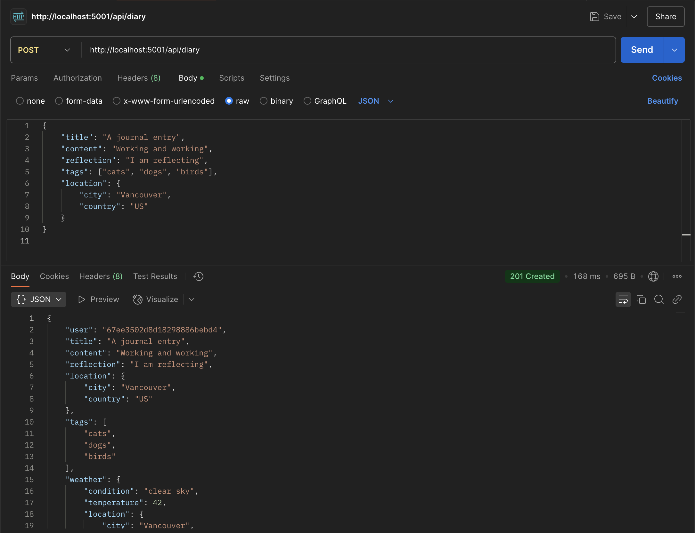
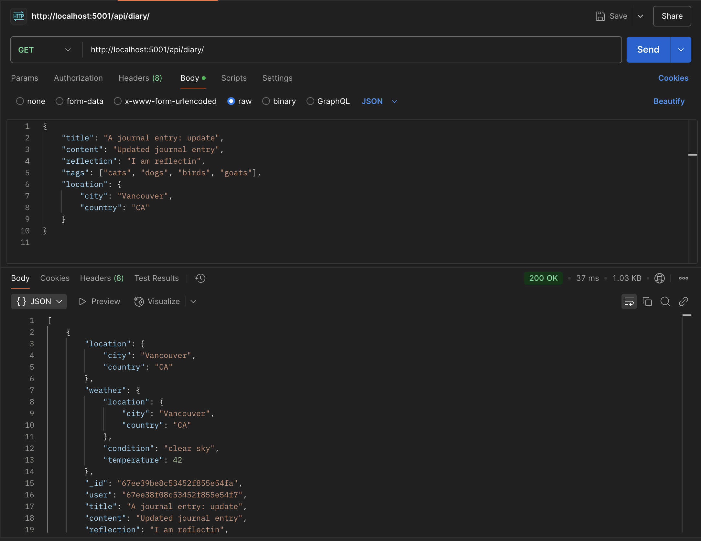
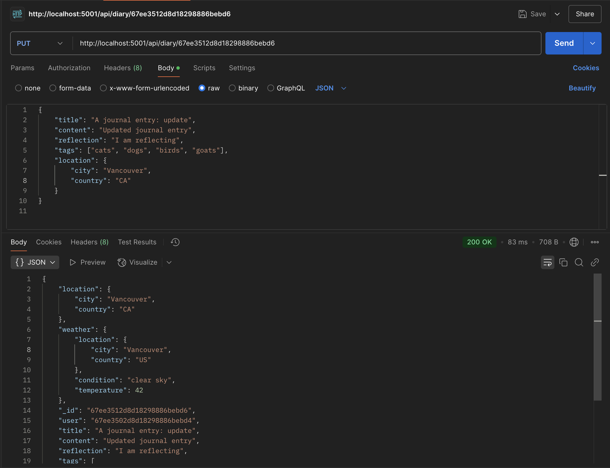
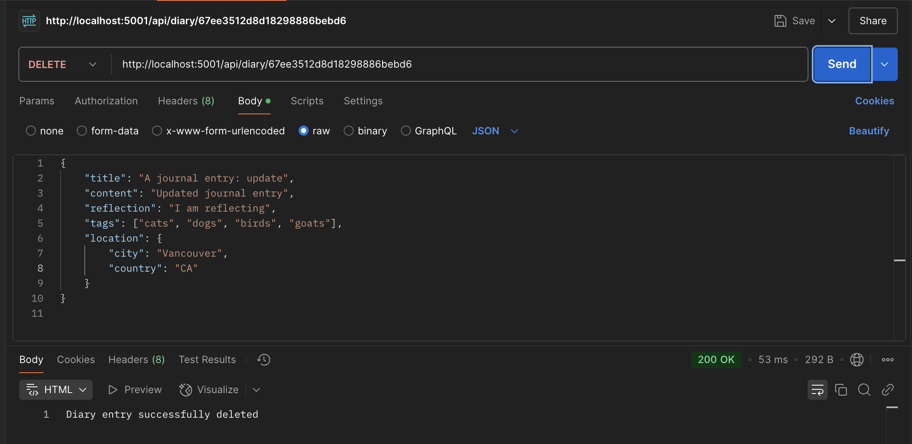
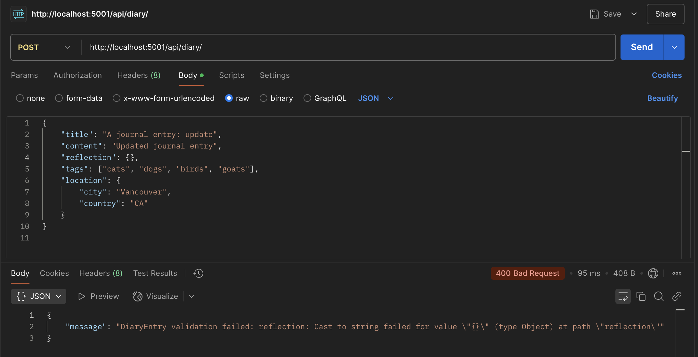
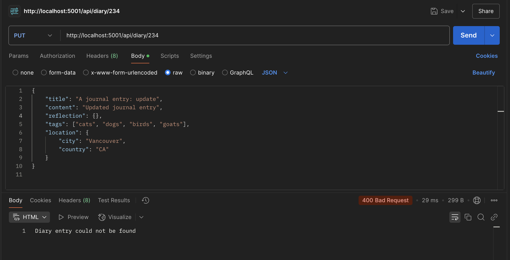

# James Lesperance

## Final Project

### Project Overview
ThoughtStream is a Digital Diary application.  User's can create accounts, post
custom diary entries, and manage their journals.

### Setup Instructions
To setup, run the following:
```
npm install
npm start
```

### Dotenv Variables
1) MONGO_URI
2) WEATHER_API_KEY
3) PORT

### API Usage Guide
Get, Post, Put, Delete

In order to use the API, start the server than open Postman.  To make a post, connect
to the localhost port in Postman and select POST.  Here is an example post that can
be entered into the body tag.  

Note that I changed the location schema to accept an object with keys city and country.

```
{
	"title": "Entry title",
	"content": "Post content",
	"reflection": "Optional reflection",
	"tags": ["tag1", "tag2"],
	"location": {
		"city": "Vancouver",
		"country": "US"
	}
}
```

#### Success





#### Failure




### Thoughts
Overall, the project went well, it was helpful to have some scaffolding to work from.  My biggest hickup was that I had named my .env file .dotenv, eventually it sank in.

